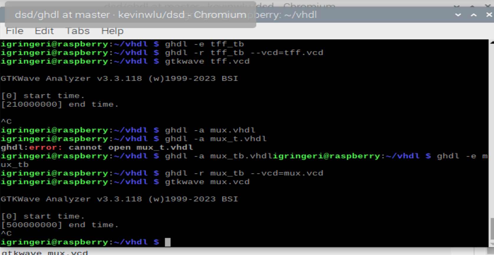
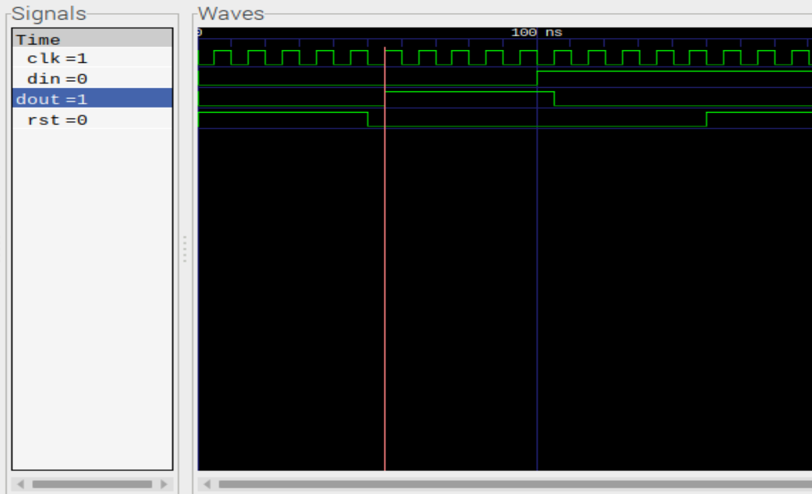

#Lab 1 info :)\
**Learning VHDL, GHDL**\

1. Install GHDL
2. Install GTKWave 
3. Run Half Adder and Multiplexer/D latch example
4. Document the Resuts
5. Pick an option and do it!

---
I want to do this lab in several ways if possible, if I can find my raspberry pi when I'm at home, I want to use that. If not, I will do GHDL, Look at VHDL and Verilog to get deeper into it.
--- 
#Raspberry Pi OS

1. Setting up the RPi Emulator was annoying, but I knew this was something that I wanted to do
2. I used VMWare since I wasn't in the mood to add another OS, or more like learn how to do another OS
3. I do think that VHDL is interestering and I like that GTK wave allows for the visualization of the process since the timing diagrams do tend to get more confusing as more inputs and/or outputs are added

###Hello World

---
###Half Adder

---
###4 to 1 Mux

---
###Tff(t flip flop)
