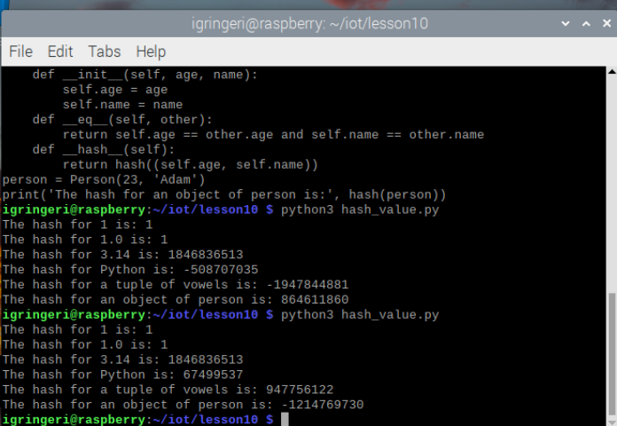
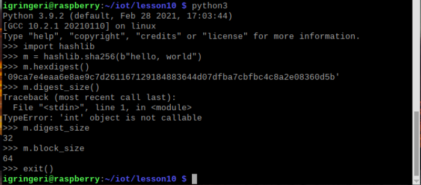
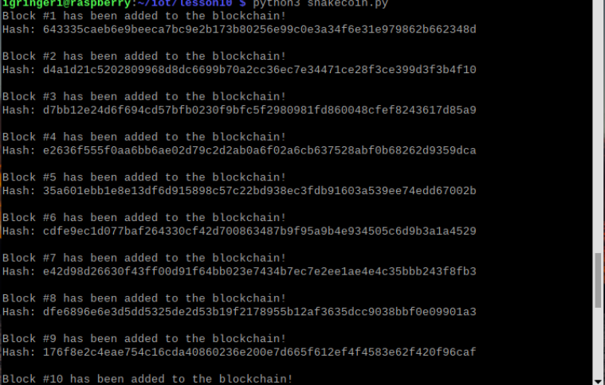
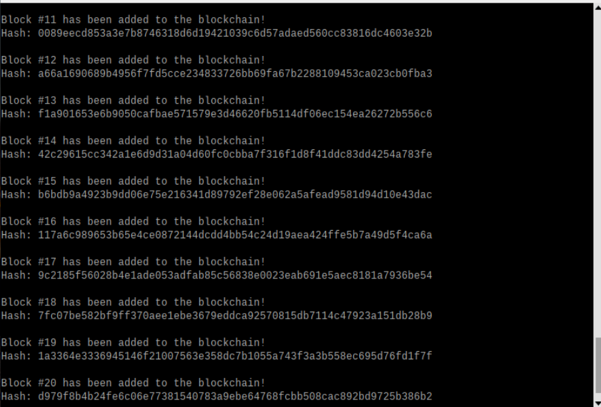
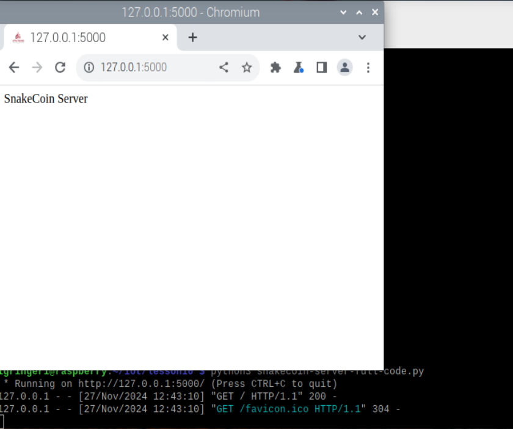
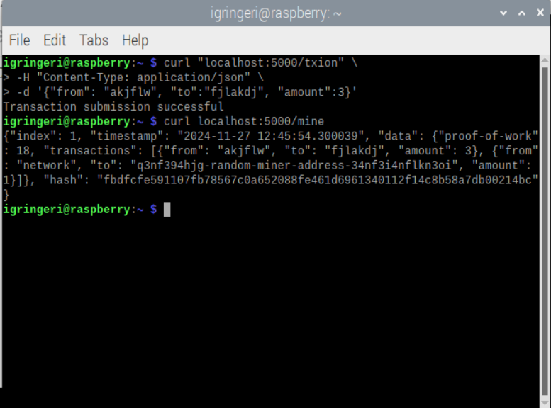
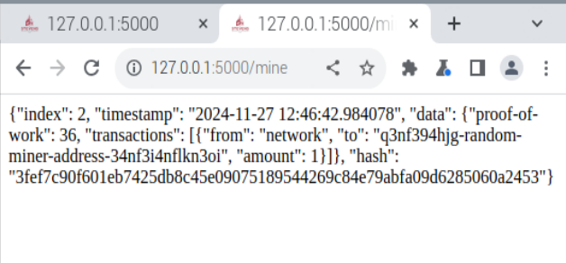
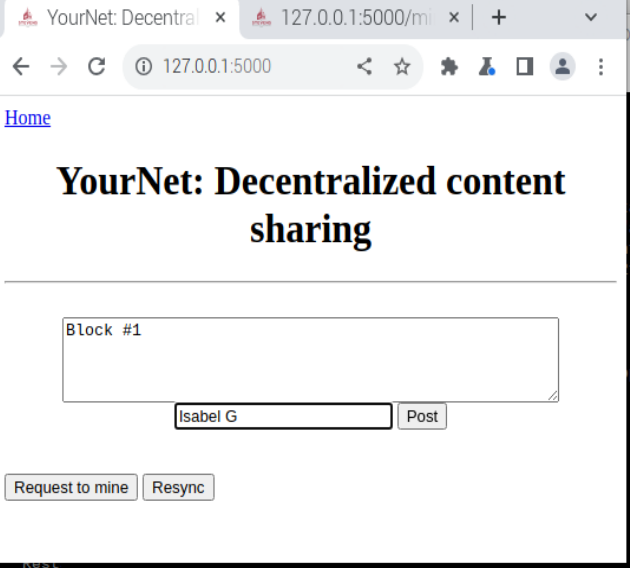
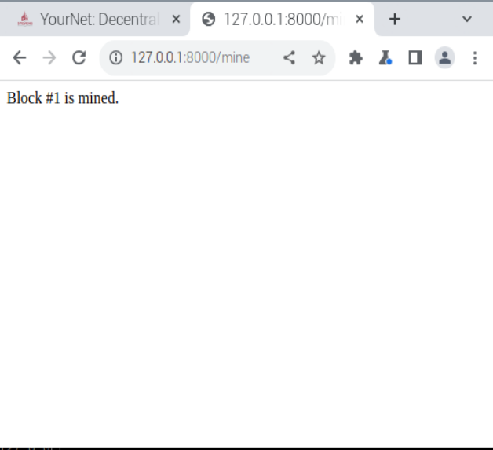
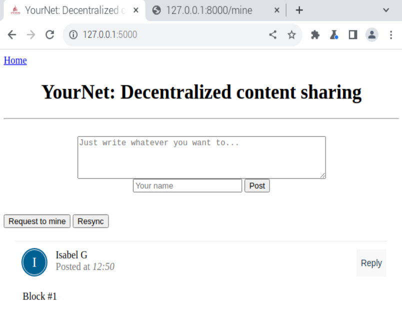

# Lab10 
---
Blockchian Lab
1. run hash_value
    * 
2. Secure Hash Algorithm (SHA)
    * 
3. Snakecoin
    * This makes a small block chain starting with 20 blocks.
    * 
    * 
4. Contonuing to make this blockchain larger
    * Run another python script to continue adding more blocks. 
    * 
    * 
    * 
    * 
    * 
    * 

---
Blockchain has always been interesting to me, even before I really knew what it was. The only reason why I was exposed to this, or at least introduced, was because my high school teacher W. S. Stornetta did the research that helped to develop Blockchain. With different classes I've learned about hashing and how peer to peer linking is important, and when linking this all with Blockchain I can see how this works well for transactions especially within currency like bitcoin, it does also leave the potential for issues since there is no altering once it is sent and there is no real way to track who/what sent/mined the currency. 