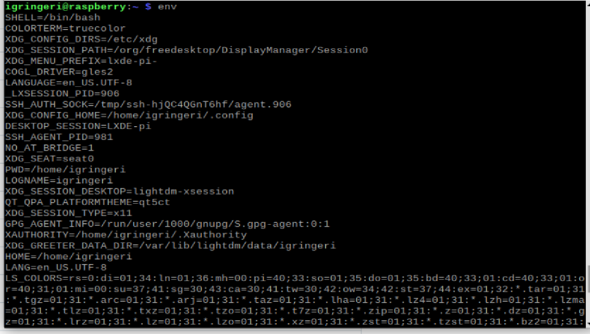
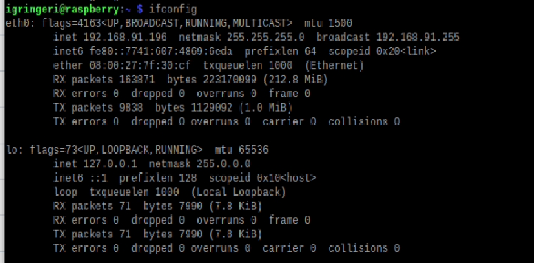
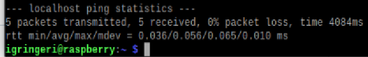
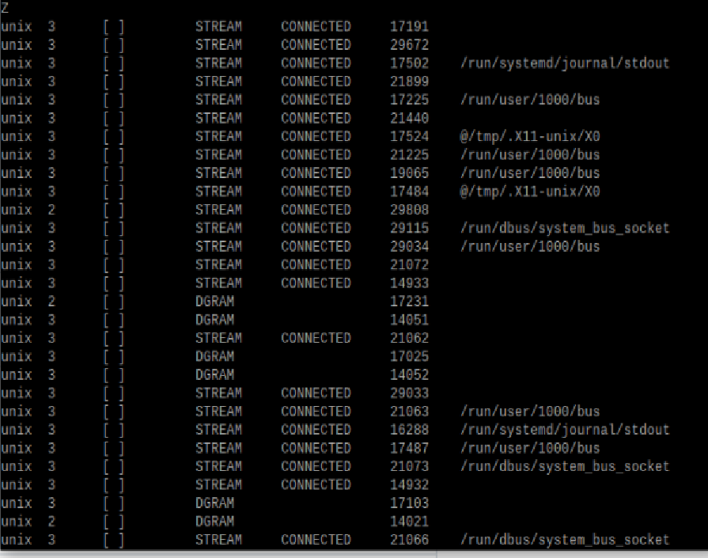
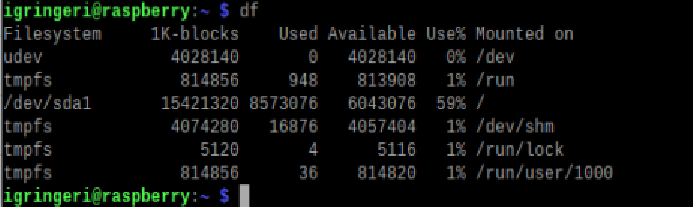
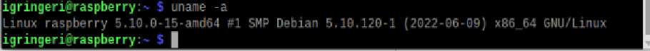

# Lab2 info

---
## **Command Line Lab** 
### I'm using an emulated raspberry pi so that I can run direct commands
I had originally wanted to work with my raspberry pi but since I'm at home right now, I don't have enough space to connect with just my touchscreen and then transfer my data over. 

---
# This lab was running different linux commands
- I have used many of these commands when I was working over the summer
- env, cd, ls, hostname, cat, ifconfig, ping, and netstat I used all of the time over the summer

1. **Hostname**
    * used when grabbing the hostname of the device, in this case it was "raspberry"
    * 
2. **env**
    * This shows the environment variables that the device is using, so in my case it will show a bunch because I am running a VM
    * 
3. **cd [./filename or .. to go back]**
    * change directory, so this is used to go into different folders like the "iot" or "dsd" folders that were cloned from the git
4. **ls**
    * this is to list the files inside of a folder/directory
5. **cat [filename]**
    * This will print the contents of the file whose name succeeds the phrase cat
6. **ifconfig**
    * this will show the different ips and networks that are curently working on the device
    * 
7. **ping [address]**
    * this will ping a secific host and see if messages will send through. You can ping for a specific amount of time or just Ctrl+C to stop and then it will tell if the packages went through or any errors
    *
8. **netstat**
    * this will show the network status, so sll of the networks for connections and such with the current device, normally there are a bunch running
    * 
---
## Commands that I haven't used often

1. **df**
    * shows disk space on the file 
    * 
2. **mkdir**
    * I haven't used this often but it is a commonly used command to make a directory
3. **nano**
    * opens a new text file. You can name it or use nano then name and save
4. **cp [originalfile] [newFile]**
    * copies a file to anotherfile
5. **mv [file1] [file2]**
    * moves file from file1 to file 2 and removes file 1
6. **rm [file]**
    * removes file
7. **clear**
    *this will clear the terminal so any past commands will no longer be in that terminal tab
8. **man [commandName]**
    * gives directions on different commands so if you don't know a command you can man [name] and it will expain
9. **uname**
    * gives information about the os and hardware that's being used 
    * 

---
## Learning
 I enjoy doing work within file systems for linux as it help me understand the file system in general and how the platform is laid out. I want to learn more about kernel space and how that can be adapted for a specific user instead of only what is built in.