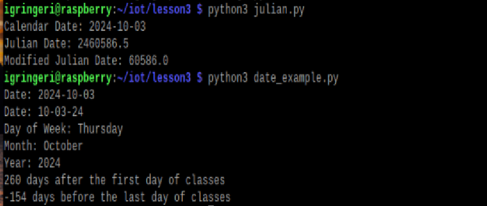
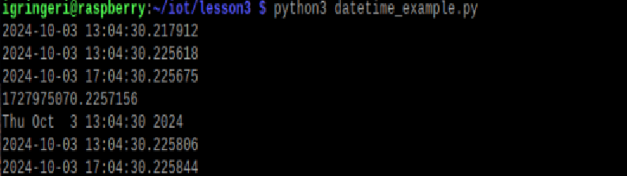
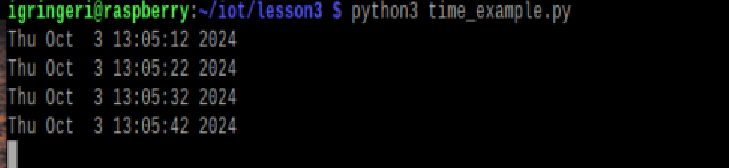
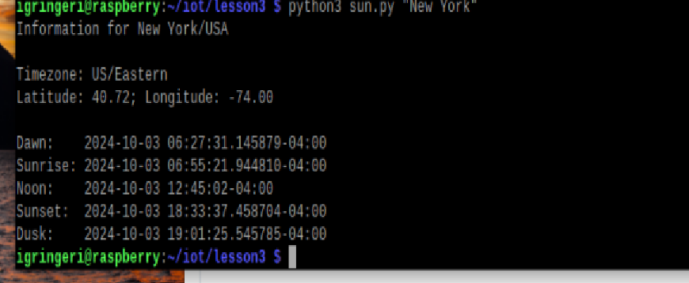
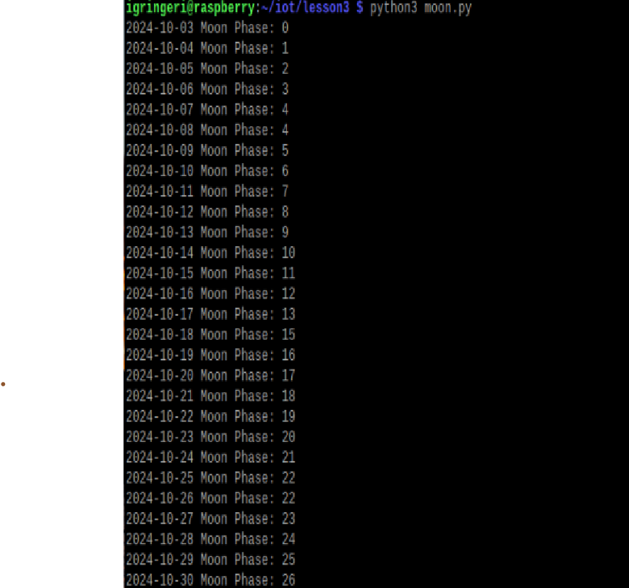
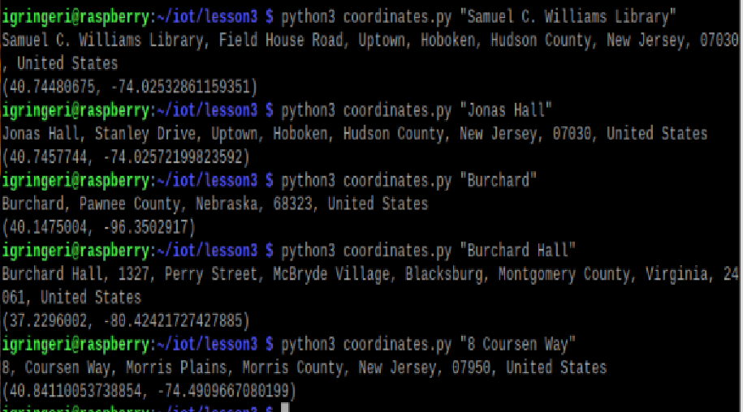
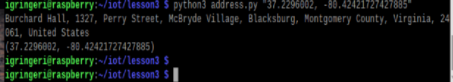
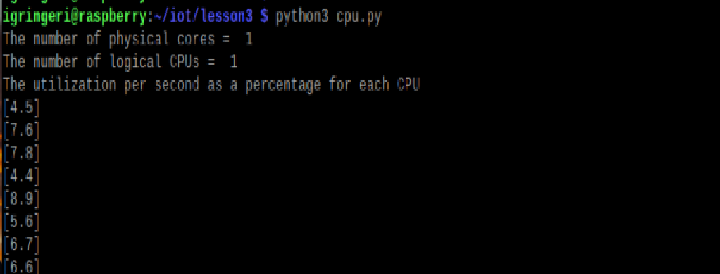
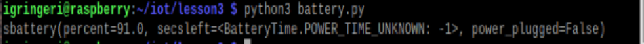
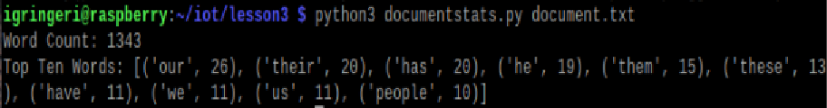

# Lab3
### Python 

--- 
**I always forget how simple python is and using straightforward language to write code in python.** 
- First step was opening up the emulator and making sure that there was python3 downloaded
- With this downloaded I attempted to start running the different programs, but I did not have all of the packages downloaded
    * I like to run these on my own before going to the lesson to see what I missed in terms of memory so that I can retain how to add packages just off the top of my head instead of not remembering every time
- And along with just running the different scripts I like to cat and read the lines to see what functions are being used

--- 
## What Each Script Entails

1. Julian and Date
    * I didn't know what a Julian date was, so cool to learn something new
    * The date with school was also cool to see and it's so weird to think that there really isn't that much time left in this year
    * 

2. Datetime Example
    * Giving current time and then 
    * 
3. Time 
    * Reads current time and updates every 10 seconds
    * 
4. Sun
    * Shows time for the sunrise/set at different locations, I like how you can do this with other places besides NY
    * 
5. Moon
    * Moon phases for the month that we're currently in => October into November
    * 
6. Coordinates 
    * finding a the longitude and latitute of a location from it's name, I used this to attempt to find Burchard but wasn't typing the correct thing I guess since I found place in other states
    * 
7. Address
    * This found the address based on the coordinates, so I picked one of the coordinates I grabbed from above to test with
    * 
8. CPU
    * shows the cpu usage in real time on your device, in my case this is for the emulated raspberry pi not my local device
    * 
9. Battery
    * battery percentage of device, in this case it would be my local device since that is how the emulatled device has power
    * 
10. Documentstats
    * Show the numbers of words and the different usage of words in a document, I remember doing something like this in CS 115 with a novel
    * 
