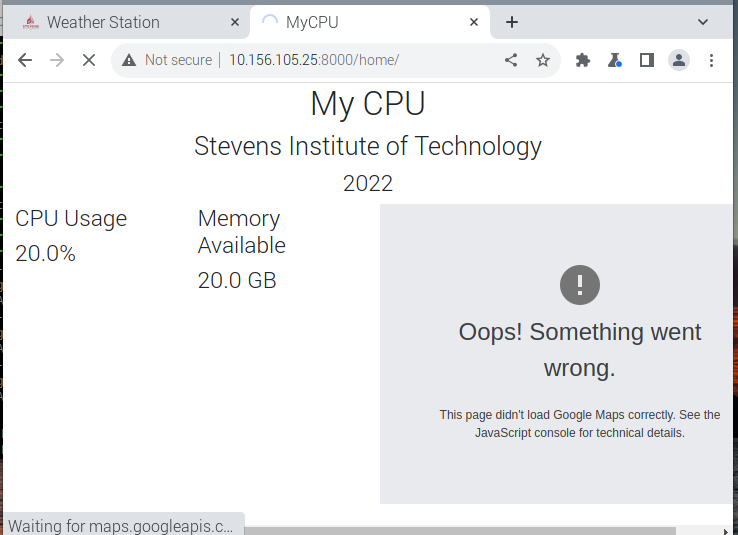

# Lab 4

### Django Structure and FLASK 
- Install Django + REST and use a database structure 
- the plan is to do this via virtual machine
    * if I have time I want to try to do it with my personal computer as well

1. Set up Django + Rest
2. set up mariadb server + client
3. Setting up stevens
    * doing this by following the steps,
    * I've never set up my own django app (or used django before)
4. setting up api key => getting annoyed since i didnt share a clipboard with my vm 
    * I was able to get the weather app working
    * 

    --- 

 ### Setting up mycpu
 1. Setting up the myCPU was a lot easier (on the code side) after the weather station
     * I was even able to utilize the copying skills so that I wouldn't have to recopy over the API key since I had to manually type it
    * 
 2. The rest of the steps I documented with pictures
    * 
     * 
    * 
3. I was able to figure this one out with help, my passwords were not set to match, so once I did this I was able to get the mycpu page to work. My api key was not working but I was able to connect the server correctly
    * 

--- 

### Flask
- I was able to get flask downloaded and working
    * 
- I started the process of the Flask-Ask but was getting frustrated so for the time being I will be stopping here