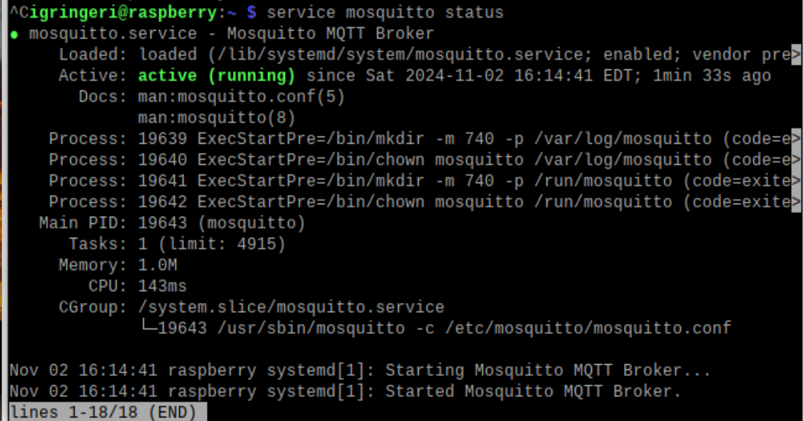
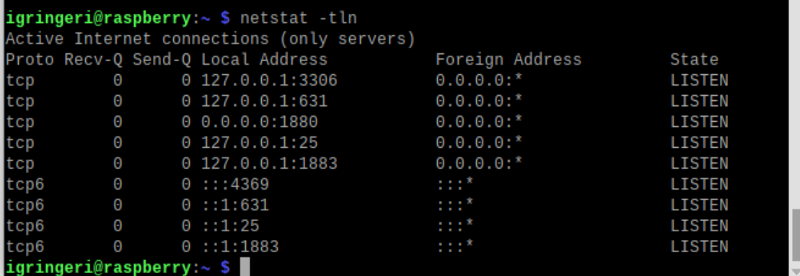
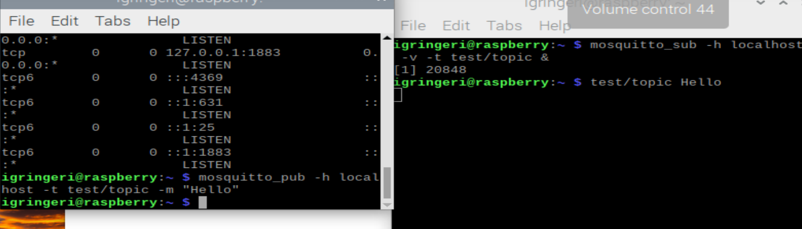
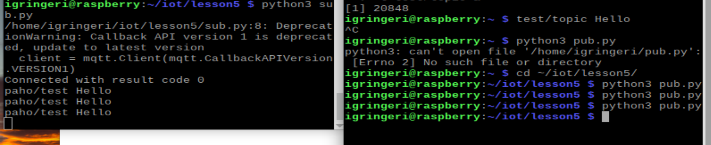
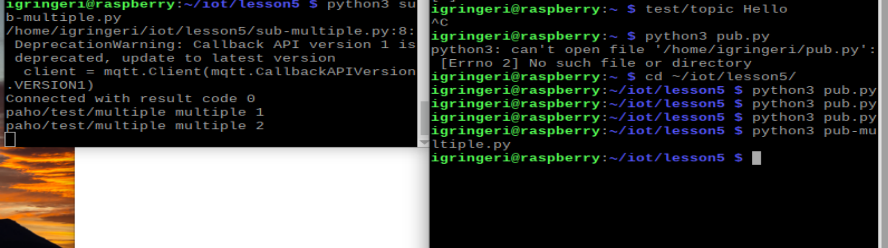
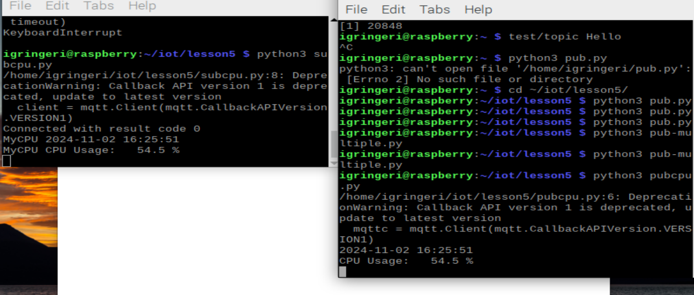

# Lab 5

### Paho + MQTT
- using sub/pub to work with subscribing and publisher
- using paho 
- looking at docker => I already have this downloaded because I worked in professor Du's lab last semester
---
1. This lab was similar to work we've done in the past with the MQTT serves through Stevens for Design 1 and 2. 
    * I do really like that we are able to see how this actually functions opposed to just running an arduino function

2. Setting up this lab was quite easy. Using my emulator, I updated my pi and made sure to install mosquitto and paho
    * 
    * 
    * 

3. Once mosquitto was set up, I tested how the publisher/subscriber worked
    * 

4. From there it was onto Paho and seeing how this worked with the MQTT
    * 
    * 
    * 

--- 
**I enjoy learning through these labs because as I get these tools to work it makes me want to read more into them. Sometimes within CompE, the tools we are given don't lead us to the background information and how they function, so I do appreciate the learning along with the documentation of where we can go from there to learn more and find other ways to use these tools.**