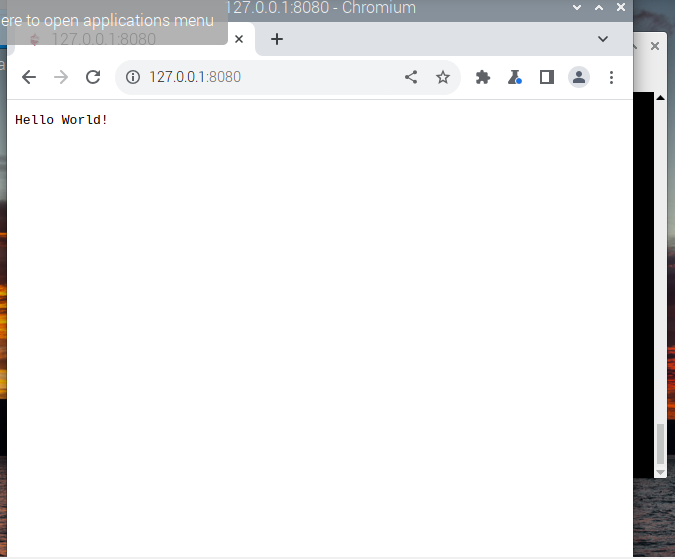

# Lab 6

-  node js on raspberrypi emulator 
- looking into different embedded devices => xiao 
- particle cloud optional assignment => looking into this if I have time
--- 
### Node JS and Pystache 
1. With running Node JS, I also looked into why it was a useful tool. Since we don't get exposed to too many tools at school, I do always enjoy looking into something new. If I have time later in the semester (ie around thanksgiving or winterbreak I want to look at the cloud assignment)
- **Node JS**
    *

- **Pystache**
    *cat
    *