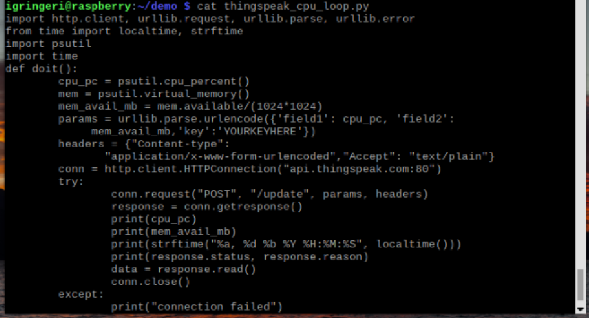
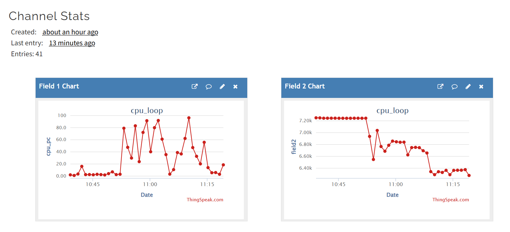
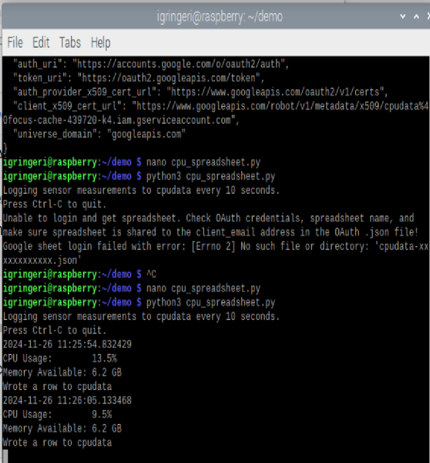
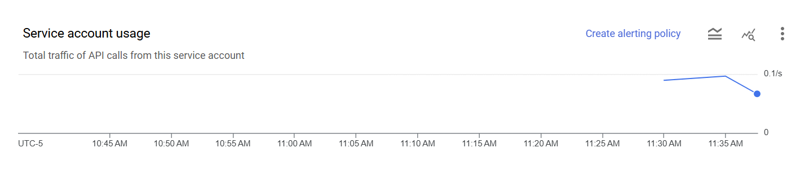

# Lab7
### Google Sheet With CPU Data

---
**This lab has been a very interesting time. My goal is to leave this running for the next hour or so that I can utilize this information with lab 8 since I remember that it was recommended that we collect more data.**

1. Starting this lab was quite easy. After already setting up a GCP account to access the Google Maps API, I did not have any issues going in a making a Service Account. Similarly, I already had a MatLab account, so it was nice and easy to get access and set up the Thingspeak. 
2. I left ThingSpeak running while I was trying to figure out the rest of the JSON set up for the Google Sheets potion of this lab, so I was able to obtain graphical data. 
    * First I set up the ThingSpeak and was able to get it running
    * 
    * Once I let it run this was the data that I was able to capture
    * 

3. Once I got the Service Account set up, I was having some issues just getting my json key to download to my emulator. I was able to fix this by logging into my Stevens email account and then opening GCP through there. 
4. Once that was figured out, I was unable to get the Data to collect as I was receiving an issue that my JSON key was not a file or a directory, so I went in edited the name of my key and then I was able to get it to run.
    * With this information I was finally able to set up the sheet and it is currently running and populating a sheet of data as I continue to do other homework before I move onto lab8
    * 
    * 

---
I want to spend more time learning about the oAuth client as I was having issues setting this up (even though it was already set up). I am intrigued in why you can set up a separate client, whether it is to access another api, I want to find out more. 
