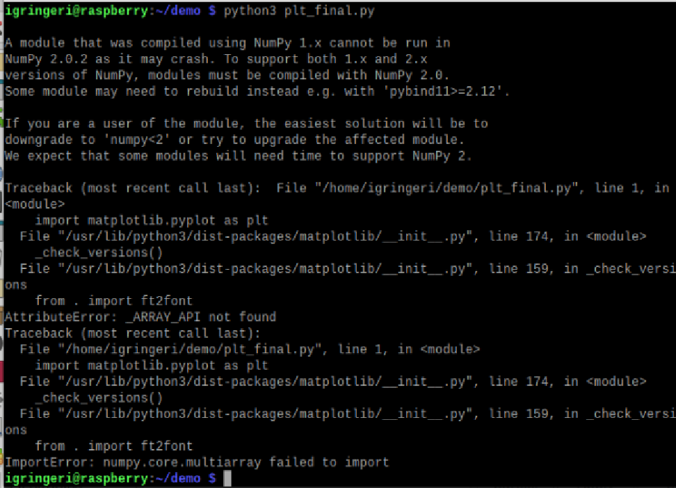

# Lab8
---
- I am currently having issues with this lab as my emulator will not update properly, so I am going to continue trying to get this to download but it has already been 2 hours, and no packet installation has helped so far
    * 
---
I reattempted Lab 7 within my physical raspberry pi instead of the emmulator, however, I was unable to sign into my google account, so accessing my api keys proved difficult. 
* I attempted opening google within my computer and then manually typing over the api keys and ensure that the script had access to the proper google sheet, but once again, there was an issue with packet installation, so I was not able to collect data which proved extremely frustrating