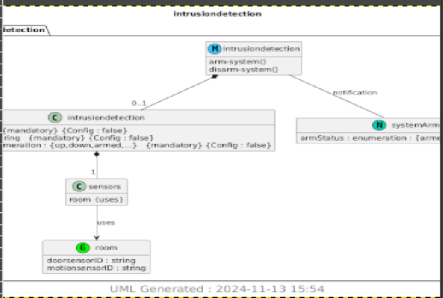
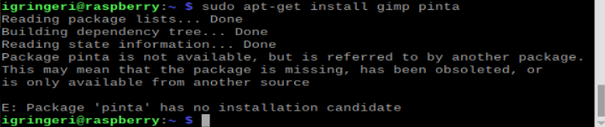

# Lab 9 

### YANG

**I really liked the transfer between the different syntax to me a different file, I haven't done anything quite like it. The only thing that I can compare it to that is similar is deciding to download something as a jpg vs png, so It was really interesting to use this**

1. I did this via my emulator, so I got plantUML working along with pyang and gimp (which I did look up and GNU Image Manipulation Program is surely a tool that I would not know existed), but pinta was not working. 
    * with the gimp I was still able to view the png image that I made so, there wasn't a problem except for poor quality, but my date and time are at the bottom
    * 
2. Looking into Pinta, which is an open source painting program, so makes sense as to why we would use it in conjunction to gimp. I followed their steps for download, but was left with the message below
    * 

--- 

I have been enjoying these labs and being able to just look into different programs that are available, as I would probably not have found this on my own if I was playing around. I am not artistically inclined, so that may be my downfall with this specific program, but I am trying to come up with software and hardware projects to work on inside and outside of school. I am appreciating the level of exposure and NEW LEARNING that I am getting through this class!